# Fluxo de Distrato (rescisão amigável) — estado atual

Ilustração do fluxo de **distrato** do ERP Construtora, já com a **rastreabilidade da regra aplicada** introduzida na Fase A (PR #18).

> Versão gráfica (renderizada): [`distrato-fluxo.svg`](./distrato-fluxo.svg)

O **distrato** é diferente de **excluir** uma venda: ele **preserva** o registro (status `CANCELLED`) para histórico/auditoria, libera o lote para nova comercialização e permite gerar o documento próprio de distrato.

---

## Diagrama (Mermaid)

```mermaid
flowchart TD
    A([Venda ATIVA<br/>contrato vigente · lote SOLD]):::start
    A --> B["Usuário clica 'Distratar venda'<br/><i>SalesPage · abre o modal</i>"]:::user
    B --> C["<b>Modal de distrato</b><br/>Data · Valor a devolver · Valor retido · Motivo<br/>― NOVO Fase A ―<br/><b>Regra aplicada (obrigatória)</b> · Memória de cálculo"]:::user
    C -->|POST /api/sales/&#123;id&#125;/distrato| V1{Venda já está<br/>CANCELADA?}:::valid
    V1 -->|SIM| E1[/Erro 400<br/>"já está cancelada/distratada"/]:::err
    V1 -->|NÃO| V2{Devolução + Retido<br/>&gt; Valor vendido?}:::valid
    V2 -->|SIM| E2[/Erro 400<br/>"não pode exceder valor vendido"/]:::err
    V2 -->|NÃO| P["<b>SaleService.distrato()</b> · @Auditable(SALE_DISTRATO)<br/>1 · status → CANCELLED (preserva histórico)<br/>2 · grava distratoDate · reason · refund · retained<br/>3 · grava <b>REGRA + MEMÓRIA</b> (Fase A)<br/>4 · libera lote → AVAILABLE, saleValue = null<br/>5 · log de auditoria<br/>6 · retorna SaleResponse"]:::backend
    P --> O1([Venda CANCELADA<br/>mantida no histórico<br/>com regra rastreável]):::out
    P --> O2([Lote AVAILABLE<br/>recomercializável]):::out
    P --> O3([Auditoria registrada<br/>usuário + timestamp]):::out
    O1 --> VIEW["Detalhe da venda distratada<br/>Distrato em {data} · Devolvido · Retido · Motivo<br/><b>+ Regra aplicada + Memória de cálculo</b>"]:::valid
    O1 --> DOC["Documento de distrato (opcional)<br/>GET /api/sales/&#123;id&#125;/distrato/pdf · template DISTRATO<br/>tokens &#123;&#123;distrato_regra&#125;&#125; / &#123;&#123;distrato_regra_detalhe&#125;&#125;<br/>→ PDF arquivado (ContractDocument DISTRATO)"]:::start

    classDef start fill:#e0f2fe,stroke:#0ea5e9,color:#0c4a6e;
    classDef user fill:#dbeafe,stroke:#3b82f6,color:#1e3a8a;
    classDef valid fill:#fef3c7,stroke:#f59e0b,color:#92400e;
    classDef backend fill:#d1fae5,stroke:#10b981,color:#065f46;
    classDef out fill:#ede9fe,stroke:#8b5cf6,color:#5b21b6;
    classDef err fill:#fee2e2,stroke:#dc2626,color:#991b1b;
```

---

## Pontos-chave do fluxo

| Etapa | Onde | Detalhe |
|---|---|---|
| Disparo | `SalesPage.tsx` | Botão "Distratar venda" em vendas `ACTIVE`; modal pré-preenche data=hoje e devolução=valor pago |
| Campos | Modal | Data, Valor a devolver, Valor retido, Motivo, **Regra aplicada** (obrigatória, com sugestões), **Memória de cálculo** (opcional) |
| Requisição | `POST /api/sales/{id}/distrato` | `DistratoRequest { distratoDate, reason, refundAmount, retainedAmount, rule, ruleDetail }` |
| Validação 1 | `SaleService.distrato` | Venda já `CANCELLED` → erro 400 |
| Validação 2 | `SaleService.distrato` | `refund + retained > totalValue` → erro 400 |
| Efeitos | `SaleService.distrato` | status→`CANCELLED`; grava dados do distrato **+ regra + memória**; lote→`AVAILABLE` (saleValue=null); `@Auditable(SALE_DISTRATO)` |
| Visualização | `SalesPage.tsx` | Bloco do distrato exibe data, devolvido, retido, motivo **e a regra aplicada + memória** |
| Documento | `GET /api/sales/{id}/distrato/pdf` | `ContractRenderer` injeta `{{distrato_regra}}` e `{{distrato_regra_detalhe}}`; PDF arquivado como `ContractDocument(type=DISTRATO)` |

**Destaque Fase A (PR #18):** os campos `distratoRule` e `distratoRuleDetail` tornam a regra aplicada **rastreável** — registrada no banco, exibida na tela e disponível como token no documento gerado.
